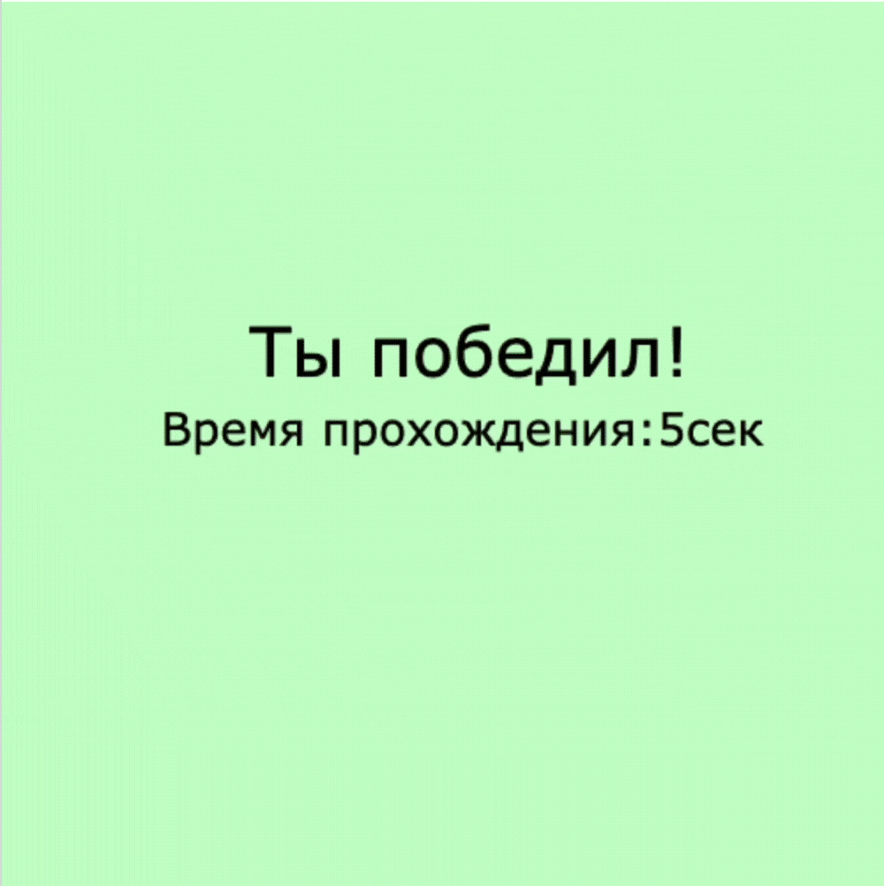

# **Click Reaction Game**

## **Overview**
This is a **simple reaction-based game** built using **Pygame**. Players must **click on the correct card** as quickly as possible before time runs out. Points are awarded for correct clicks and deducted for wrong clicks. The game ends when the timer runs out or the player reaches a score of **5 points**.

## **Features**
- 🎯 **Reaction-Based Gameplay** – Click on the correct highlighted card.
- ⏳ **Time-Limited Challenge** – Players must act before time expires.
- ✅ **Score Tracking** – Gain points for correct clicks and lose points for mistakes.
- 🎨 **Dynamic UI with Colors** – Visual feedback for correct and incorrect choices.
- ⚡ **Randomized Card Selection** – Each round presents a new challenge.

## **Installation & Setup**
### **1. Install Python & Pygame**
Ensure you have **Python 3.x** installed, then install Pygame:
```sh
pip install pygame
```

### **2. Run the Game**
Execute the following command in the terminal:
```sh
python game.py
```

## **Game Rules & Controls**
- **Left-click** on the correct card to score a point.
- A **random card** is chosen every round.
- **Green** = Correct click ✅ (+1 Point)
- **Red** = Incorrect click ❌ (-1 Point)
- The game ends when:
  - **Time runs out** (11 seconds)
  - **You reach 5 points** (You win!)

## **Code Breakdown**
### **1. Setting Up the Game Window & Colors**
```python
window = pygame.display.set_mode((500, 500))
window.fill((200, 255, 255))  # Light Blue Background
clock = pygame.time.Clock()
```

### **2. Creating Clickable Cards**
```python
cards = []
x_start = 50
for i in range(4):
    new_card = Label(x_start, 170, 70, 100, (255, 255, 0))  # Yellow Cards
    new_card.outline((0, 0, 100), 10)  # Dark Blue Border
    new_card.set_text("CLICK", 26)
    cards.append(new_card)
    x_start += 100
```

### **3. Handling Mouse Click Events**
```python
for event in pygame.event.get():
    if event.type == pygame.MOUSEBUTTONDOWN and event.button == 1:
        x, y = event.pos
        for i in range(len(cards)):
            if cards[i].collidepoint(x, y):
                if (i + 1) == random_card:
                    cards[i].set_color((0, 255, 51))  # Green (Correct Click)
                    points += 1
                else:
                    cards[i].set_color((255, 0, 0))  # Red (Wrong Click)
                    points -= 1
                cards[i].draw()
```

### **4. Win & Lose Conditions**
```python
if points >= 5:
    mw = Label(0, 0, 500, 500, (200, 255, 200))  # Light Green (Win Screen)
    mw.set_text('Ты победил!', 60, (0, 0, 0))
    mw.write(140, 180)
    break

if new_time - start_time >= 11:
    mw = Label(0, 0, 500, 500, (250, 128, 114))  # Light Red (Time Out)
    mw.set_text("Время вышло!", 60, (0, 0, 0))
    mw.write(110, 180)
    break
```



## **Future Enhancements**
🚀 **Difficulty Levels** – Add easy, medium, and hard modes.

🎨 **Custom Themes** – Allow users to change background and card colors.

📊 **Leaderboard** – Save high scores for competitive play.

🔊 **Sound Effects** – Add click and win/lose sounds.

## **License**
This project is **open-source** and free for use.

## **Author**
Developed by **Sofiya Dassayeva**.

